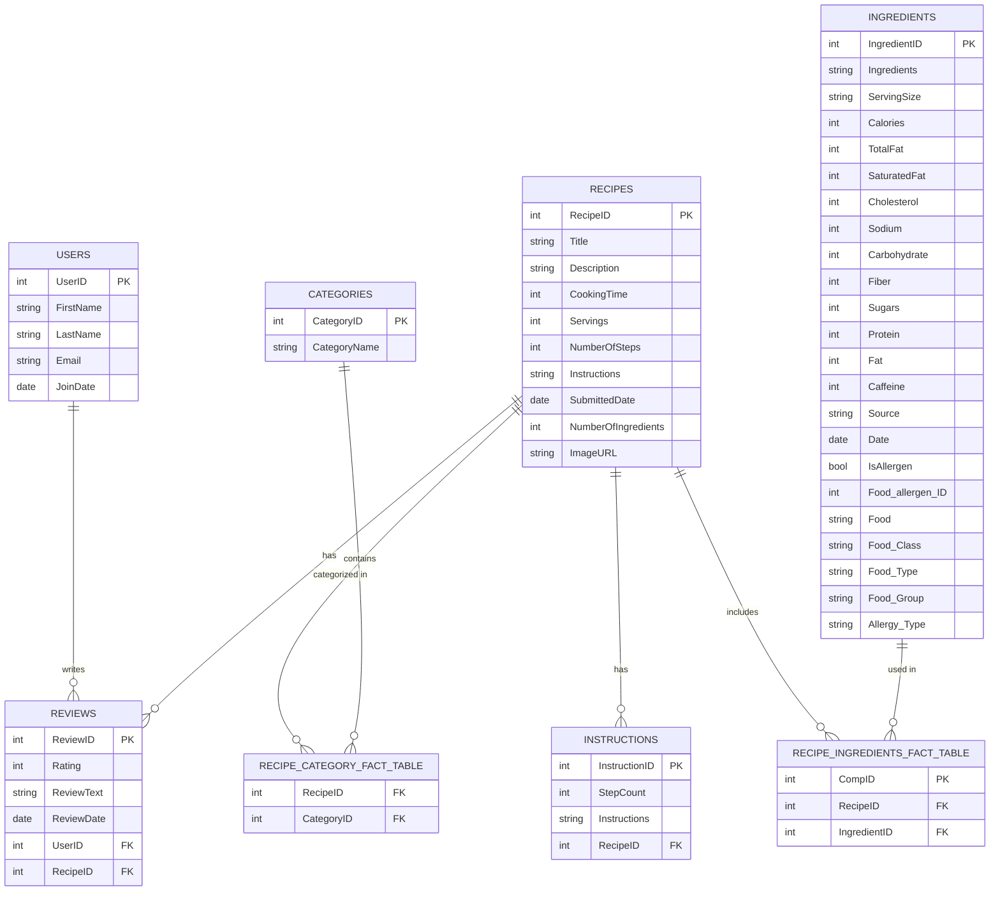

# Data Model

The data model for the recipe database is shown below. The system has eight tables: `Users`, `Categories`, `Recipes`, `Instructions`, `Recipes_Ingredients_fact_table`, `Recipe_Category_fact_table`, `Reviews` and `Ingredients`. The `Recipes` table contains a list of all named recipes. The `Ingredients` table contains a list of every ingredient for all recipes. The `Users` table has a list of users who have registered and reviewed recipes; while `Reviews` contains a list of each reviews and rating for the recipe.Finally, the `Instructions` table has a list of each set of instructions per recipe and the `Categories` table has a unique list of recipe categories. 

## Users has the following columns:
- **UserID** (PK)
- FirstName
- LastName
- Email
- JoinDate

## Categories has the following columns:
- **CategoryID** (PK)
- CategoryName

## Recipes has the following columns:
- **RecipeID** (PK)
- Title
- Description
- CookingTime
- Servings
- NumberOfSteps
- Instructions
- SubmittedDate
- NumberOfIngredients
- ImageURL

## Instructions has the following columns:
- **InstructionID** (PK)
- StepCount
- Instructions
- **RecipeID** (FK)

## Recipe Category Fact Table has the following columns:
- **RecipeID** (FK)
- **CategoryID** (FK)

## Reviews has the following columns:
- **ReviewID** (PK)
- Rating (1 to 5 stars)
- ReviewText
- ReviewDate
- **UserID** (FK)
- **RecipeID** (FK)

## Ingredients has the following columns:
- **IngredientID** (PK)
- Ingredients
- ServingSize
- Calories
- TotalFat
- SaturatedFat
- Cholesterol
- Sodium
- Carbohydrate
- Fiber
- Sugars
- Protein
- Fat
- Caffeine
- Source
- Date
- IsAllergen
- Food_allergen_ID
- Food
- Food_Class
- Food_Type
- Food_Group
- Allergy_Type

## Recipe Ingredients Fact Table has the following columns:
- **CompID** (PK)
- **RecipeID** (FK)
- **IngredientID** (FK)
